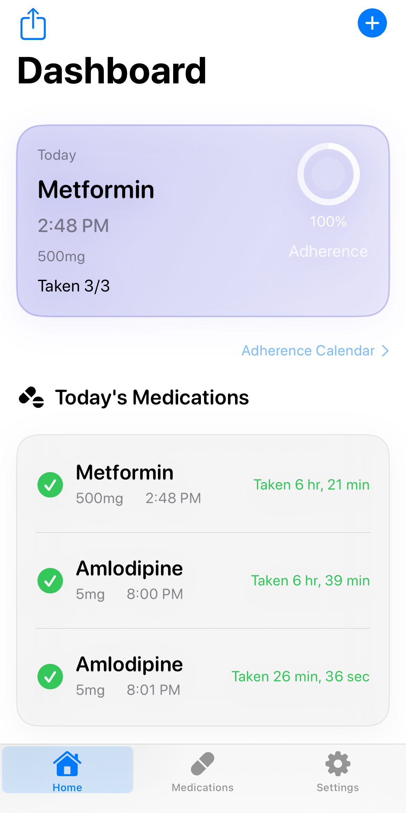

# ChronicCare



ChronicCare is an offline-first SwiftUI app for chronic medication management. It combines reliable medication reminders, fast health logging, medication-specific detail views, and lightweight adherence insights in a product designed for daily use.

## Why This Project

ChronicCare is built around a simple goal: make routine medication tracking feel trustworthy, calm, and actionable.

It focuses on:

- reliable scheduled reminders with snooze, follow-up, badge updates, and lifecycle cleanup
- low-friction logging for medications and measurements
- medication detail views that connect adherence, reminder status, and related health trends
- local-first storage with backup, restore, PDF export, and optional HealthKit integration

## Current Product Structure

- **Today**: the execution screen for what needs attention now, what is overdue, and what is coming later today
- **Health**: the management workspace for medications, reminder diagnostics, emergency card access, caregivers, trends, and latest measurements
- **Medication Detail**: a single-medication view for snapshot status, reminder strategy, adherence history, related measurements, and maintenance state

## Core Features

- **Adaptive reminders**: scheduled notifications, follow-up reminders, snooze flows, same-day suppression, badge math, refill reminders, and course-end reminders
- **Medication management**: add/edit flows, OCR label scan via camera, PRN vs. scheduled logic, inventory tracking, and course duration handling
- **Measurement logging**: blood pressure, glucose, weight, and heart rate with unit handling and trend views
- **Reminder diagnostics**: explain why a medication will or will not notify, including missing times, reminders off, or notification permission issues
- **Safety & support**: emergency card, caregiver support flow, and missed-dose support context
- **Localization**: English and Simplified Chinese (`zh-Hans`)

## Tech Stack

| Layer | Implementation |
| --- | --- |
| UI | SwiftUI, Swift Charts, custom cards/badges in `DesignSystem.swift` |
| Data | Codable JSON persistence through `DataStore` |
| Notifications | `UNUserNotificationCenter`, custom notification handler, time-sensitive reminder flow |
| Health | HealthKit import/export helpers |
| Export | PDF generation, backup/restore, share sheets |
| Testing | Swift Testing in `ChronicCareTests` |

## Project Layout

```text
ChronicCare/
├── ChronicCareApp.swift
├── ContentView.swift
├── DataStore.swift
├── Models.swift
├── NotificationManager.swift
├── NotificationHandler.swift
├── DesignSystem.swift
├── MedicationOCRService.swift
├── HealthKitManager.swift
├── PDFGenerator.swift
├── Views/
│   ├── DashboardView.swift
│   ├── HealthView.swift
│   ├── MedicationsView.swift
│   ├── MeasurementsView.swift
│   ├── ProfileView.swift
│   ├── CaregiversView.swift
│   └── EmergencyInfoView.swift
└── zh-Hans.lproj/
```

## Build

Open the project in Xcode and run the `ChronicCare` scheme.

Command-line build:

```bash
xcodebuild -scheme ChronicCare -sdk iphonesimulator build
```

Requirements:

- Xcode 15 or newer
- iOS 16 deployment target
- notification permission for reminder testing
- HealthKit entitlement and usage descriptions if Health features are enabled

## Notes

- Data is stored locally on device by default.
- AI-related configuration exists in Settings, but the core reminder engine does not depend on AI.
- This app is intended for self-management support and product experimentation. It is not a medical device and does not provide medical advice.
