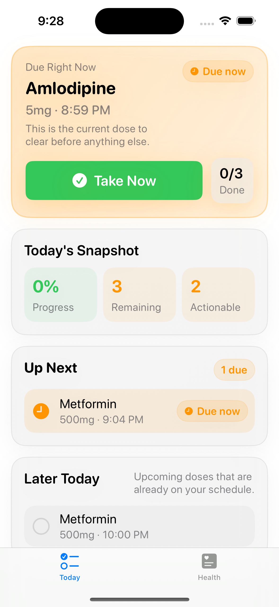

# ChronicCare



ChronicCare is a privacy-first iOS app prototype for chronic medication routines. It helps users reduce missed doses, log health measurements, track inventory/course status, and understand whether their reminders are actually set up correctly.

The project is intentionally focused on one product question: **can a real chronic-care user complete setup and keep returning for a 7-day medication routine?**

## Product Thesis

Medication reminders are only useful when they are reliable, low-friction, and easy to explain. ChronicCare is designed around a small daily loop:

1. Add medications quickly, including camera-based OCR label suggestions.
2. Receive scheduled reminders with snooze and follow-up handling.
3. Mark doses as taken from Today.
4. Review adherence, reminder coverage, inventory, and related health measurements.

## Demo Flow

For a public demo, use this path:

```text
Add Medication -> Scan Label -> Set Reminder -> Today Check-in -> Medication Detail -> Reminder Coverage
```

Recommended sample data:

- Medications: `Amlodipine 5 mg`, `Metformin 500 mg`, `Atorvastatin 20 mg`
- Measurements: blood pressure `128/82 mmHg`, glucose `105 mg/dL`
- Scenario: one medication due now, one later today, one with inventory tracking

## Core Features

- **Today**: task-first check-in surface for due, overdue, snoozed, later, and PRN medications
- **7-day rhythm**: lightweight first-week feedback to show whether the setup is ready and whether the user is returning
- **Medication setup**: add/edit flows, camera OCR suggestions, scheduled vs. PRN modes, inventory, and course duration
- **Reminder reliability**: scheduled notifications, snooze, follow-up reminders, same-day suppression, badge updates, refill alerts, and course-end alerts
- **Reminder coverage**: diagnostics for missing times, reminders off, notification permission issues, and PRN behavior
- **Health context**: blood pressure, glucose, weight, and heart-rate logging with medication-linked detail views
- **Safety support**: emergency card, caregiver records, and missed-dose support context
- **Local-first storage**: Codable JSON persistence, backup/restore, PDF export, and optional HealthKit integration
- **Localization**: English and Simplified Chinese (`zh-Hans`)

## Tech Stack

| Layer | Implementation |
| --- | --- |
| UI | SwiftUI, Swift Charts, custom cards/badges in `DesignSystem.swift` |
| Data | Codable JSON persistence through `DataStore` |
| Notifications | `UNUserNotificationCenter`, custom notification handler, time-sensitive reminder flow |
| Health | HealthKit import/export helpers |
| Export | PDF generation, backup/restore, share sheets |
| Testing | Swift Testing in `ChronicCareTests` |

## Privacy & Safety

- Data is stored locally on device by default.
- OCR suggestions are treated as editable candidates; users must confirm medication name and dose before applying.
- ChronicCare is for self-management support and product experimentation.
- It is not a medical device, does not diagnose conditions, and does not provide medical advice.
- Medication changes should always be discussed with a clinician.

## Project Layout

```text
ChronicCare/
├── ChronicCareApp.swift
├── ContentView.swift
├── DataStore.swift
├── Models.swift
├── NotificationManager.swift
├── NotificationHandler.swift
├── DesignSystem.swift
├── MedicationOCRService.swift
├── HealthKitManager.swift
├── PDFGenerator.swift
├── Views/
│   ├── DashboardView.swift
│   ├── HealthView.swift
│   ├── MedicationsView.swift
│   ├── MeasurementsView.swift
│   ├── ProfileView.swift
│   ├── CaregiversView.swift
│   └── EmergencyInfoView.swift
└── zh-Hans.lproj/
```

## Build

Open the project in Xcode and run the `ChronicCare` scheme.

Command-line build:

```bash
xcodebuild -scheme ChronicCare -sdk iphonesimulator build
```

Requirements:

- Xcode 15 or newer
- iOS 16 deployment target
- notification permission for reminder testing
- HealthKit entitlement and usage descriptions if Health features are enabled

## Current Limitations

- This is an alpha product prototype, not an App Store release.
- Notification reliability still needs real-device regression testing across foreground/background, cross-day, time-zone, snooze, taken, skip, refill, and course-end flows.
- OCR can misread medication labels and should only reduce typing, not replace user confirmation.
- Caregiver support is local/product-prototype level and not a clinical escalation system.
- AI configuration exists, but the core reminder system does not depend on AI.

## Roadmap

- Real-device notification regression checklist
- More conservative OCR review and correction flow
- More consistent large-text accessibility review for older users
- Cleaner Medication Detail vs. Edit Medication separation
- Public demo video and TestFlight-ready build once Apple Developer Program access is available
